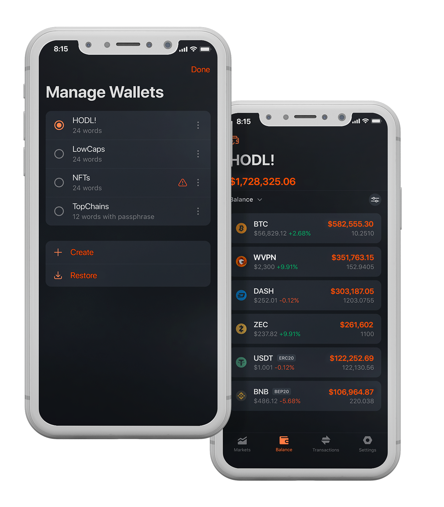

# 💼 WalletVPN

<mark style="background-color:orange;">****</mark>

<mark style="background-color:orange;">**WalletVPN**</mark> brings you a multi-currency that supports BTC, ETH and Z cash, fully protected, with an innovation in the process, where for registration there is no need for **KYC procedures**, thanks to the **Tor** networks and protocols that complement our <mark style="background-color:orange;">**WalletVPN**</mark>, it has a strong and user-centric architecture, in which its users have their own keys and their own privacy.

A version web and Android platform (IOS coming soon) with fully intuitive visual aspects, conditioning from the most expert in the market, even the first contact of a new investor !

<mark style="background-color:orange;">**WalletVPN**</mark> is fully decentralized, where transactions can be made anywhere and anytime, as long as there is internet, not custody! This is a very important factor for investors to have total control over their funds.

<mark style="background-color:orange;">**WalletVP**</mark> unites the most current **DeFi** concepts, stock alerts and even investor guidance ! Everything to bring our investors a unique and exclusive experience.

<mark style="background-color:orange;">**WalletVPN**</mark>  developed a range of digital currency wallets with a web-based exchange, iOS and Android devices capable of storing 100 cryptocurrencies including Bitcoin, Ethereum, Litecoin, Dogecoin, Monero and Bytecoin in one place.&#x20;

The <mark style="background-color:orange;">**WalletVPN**</mark> family includes Multiwallet (iOS and Android), 30 individual wallets each tailored to a specific currency, and <mark style="background-color:orange;"></mark> <mark style="background-color:orange;"></mark><mark style="background-color:orange;">**WVPN.**</mark>

#### <mark style="background-color:orange;">Objective</mark>

Our objectivel from day one was to develop applications that allow users to become familiar with popular cryptocurrencies without having to delve into specific technical features and complex configurations

#### <mark style="background-color:orange;">Our values</mark>

Our team consists of 30 people who are very passionate about what they do. We read all the comments received and use them all to adjust the tour to our users' expectations. Our main values:

#### <mark style="background-color:orange;">We support freedom</mark>

* [x] We support anonymity and have a decentralized vision of the future. Above all, however, we support freedom of choice. The more choices consumers and businesses have, in the form of a decentralized or centralized system, the better.

#### <mark style="background-color:orange;">Reputation Matters</mark>

* [x] As a company, we are investing heavily in customer support and in our ongoing development. We are not perfect, but we never put our reputation at risk on purpose. We are making cryptocurrency easy for beginners, experienced and respectful miners. We want to make the benefits of blockchain available to as many people from as many places as possible

#### <mark style="background-color:orange;">Unchain Assets</mark>

Protect capital from inflation, confiscation or censorship. Don't let companies freeze your assets or prevent you from trading.

* **Multi Wallet -** Securely manage multiple wallets that can store each token in one application.
* **Non Custodial -** Have exclusive control over your funds without relying on a custodian.
* **Decentralized -** Access and transact anytime, anywhere as long as the internet is available.

#### <mark style="background-color:orange;">Go Borderless</mark>

Bypass the traditional layers of the financial ecosystem and enter the world of decentralized finance (DeFi) with unconditional opportunity.

* **DeFi Enabled -** Exchange assets, rent assets and interact with any DeFi service through WalletConnect.
* **Investor Oriented  -** Explore and navigate the crypto market with institutional level analysis.
* **Action Alerts -**  Be among the first to react to market events that affect price. Soon!

#### <mark style="background-color:orange;">Stay Private</mark>

Use a tool that is designed to work for you, has no way of tracking you, and takes extra steps to ensure privacy from prying eyes.

* **Genuinely Private -** No server has user accounts or credentials of any kind.
* **No Checks -** The application does not contain traditional financial elements that require authentication.
* **TOR Enabled -** Keep your connection context private, even to your ISP.

<figure><figcaption></figcaption></figure>
