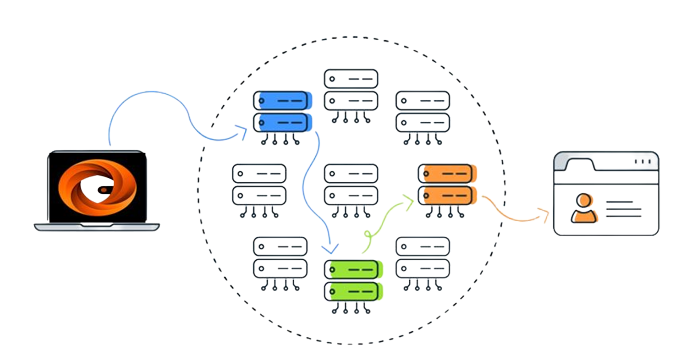
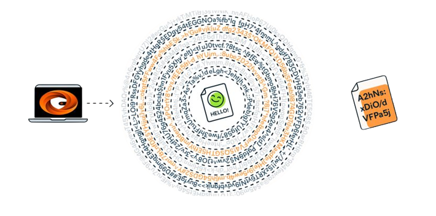

# 🔸 Tor network integration with WalletVPN

<mark style="background-color:orange;">**WalletVPN**</mark>** ** will use the Tor network, which, like the page below, brings with it several security concepts, but above all an **anonymous network**, far away from inspections and organizations with the purpose of taxing your transactions and negotiations. Our protocol hides cloaking activities and blocks tracking, and with this we will have concepts of registrations without the need for **KYC PROCESSES.**


[.](./)


Every <mark style="background-color:orange;">**WalletVPN**</mark> process is based on the tor network, we will show below how our <mark style="background-color:orange;">**WalletVPN / Tor**</mark> protocol inputs and nodes work:

<figure><figcaption>
<strong>Tor together with WalletVPN sends web traffic through an inbound node (blue), intermediate node (green), and outbound node (orange) to encrypt and decrypt the traffic.</strong>
</figcaption></figure>

<figure><figcaption>
<strong>Your web traffic goes through thousands of layers of decryption when connecting to the Internet via WalletVPN.</strong>
</figcaption></figure>

